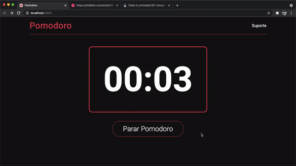

<h1 align="center">Pomodoro Timer</h1>
<h2>📸 Overview: </h2>

<h2>💻 Project: </h2>

    <h3>Portuguese:</h3>
    O projeto é um timer Pomodoro simples. Quando o timer chega em 00:00 uma notificação (com som) é mostrada pelo browser. Você não pode pausar o timer, porque a ideia do Pomodoro é completar o ciclo de 25 minutos sem ter nenhuma pausa.

    <h3>English:</h3>
    This is a simple Pomodoro Timer application. When the timer reaches 00:00
    a browser notification (with sound) is showed. You cannot pause the timer, because the
    idea is to complete the 25 minutes cicle without having any pauses.

<h2>🚀 Technologies used:</h2>
<h4>✔️ CSS (CSS Modules)</h4>
<h4>✔️ ReactJS</h4>
<h4>✔️ React Hooks</h4>
